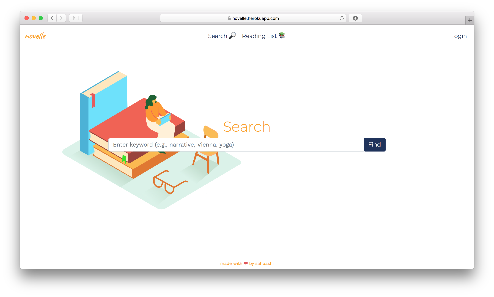
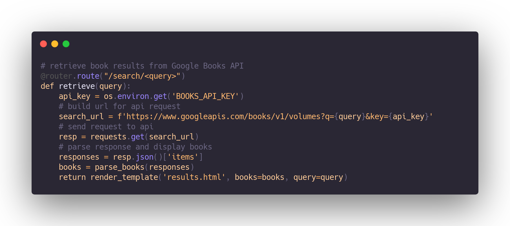

# Novelle: Book Finder
A Flask web application that allows users to browse for books and save them to a reading list for later. 

### Built with:
* [Flask](https://palletsprojects.com/p/flask/) - Backend
* [Jinja2](https://jinja.palletsprojects.com/en/3.0.x/) - Template engine
* [Bootstrap](https://getbootstrap.com) - UI framework
* [SQLite](https://www.sqlite.org/index.html) - Database
* [Google Books API](https://developers.google.com/books) - Search API

## Demo
This application is currently deployed on Heroku at https://novelle.herokuapp.com.

## License
Released under the MIT License. See `LICENSE` for more information.

## Acknowledgements
* [Book Illustration](https://www.manypixels.co/gallery)
* [Color Scheme](https://coolors.co)
