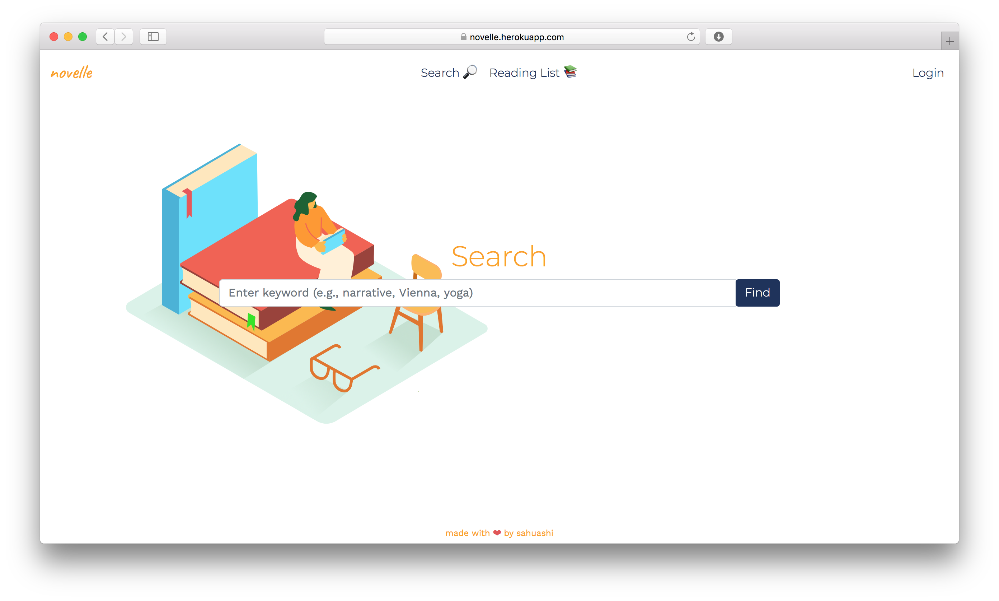
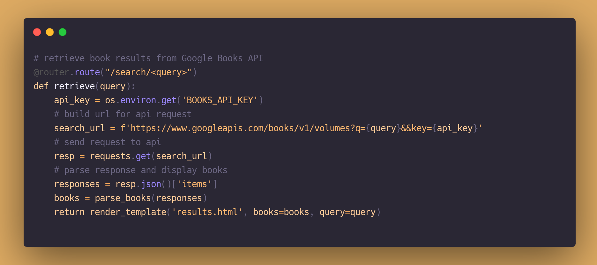

# Novelle
A web application that allows users to browse for books and save them to a reading list for later. 

Built with Python, Flask, Bootstrap, SQLite and Google Books API.

## Demo

This application is currently deployed on Heroku at https://novelle.herokuapp.com.

In order to save books to a reading list, you must create an account. For testing purposes, you may use the following sample credentials: username: `guest` & password: `pass123`.

## License
Released under the MIT License. See `LICENSE` for more information.

## Acknowledgments
* [Google Books API](https://developers.google.com/books)
